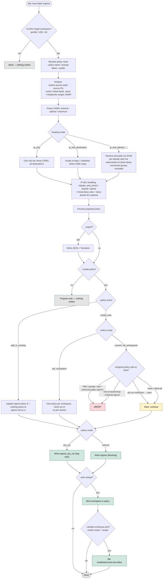
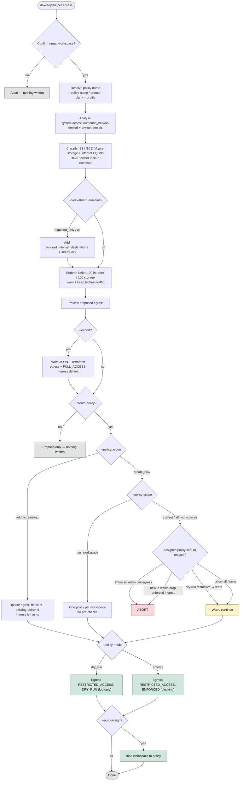
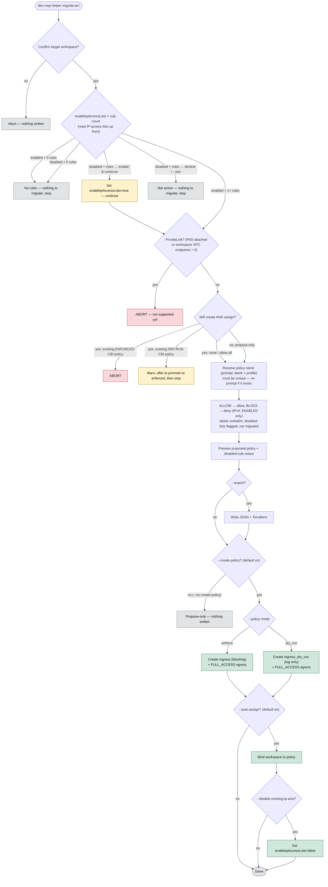

# 🛡️ Databricks Network Policy Helper

> Build Databricks **account network policies** from *real observed traffic* — not guesswork.

`dbx-nwp-helper` is a visually engaging CLI that turns the Databricks system tables into proposed
**account network policies**, with a dry-run-first, review-gated apply path. Both directions are
covered:

- 📥 **Ingress** — context-based ingress (CBI): who may connect *in*, by source IP.
- 📤 **Egress** — serverless egress (SEG): where workloads may connect *out*, by destination.
- 🔁 **IP ACL migration** — recreate an existing IP access list as a CBI policy, verbatim.

🔗 Each direction can either **create a new policy** *or* **add its rules to an existing** one — so
run them one after the other, pointed at the same policy, for a combined ingress + egress policy.

## ⚠️ Warning
- A network policy controls access to/from your Databricks environment.
- The Databricks Network Policy Helper generates candidate policies based on observed traffic which are intended to serve as a starting point— they are not guaranteed to be complete or correct.
- You are solely responsible for reviewing the generated policies and confirming they are accurate and appropriate before using them in a policy.
- An incorrect or incomplete allow-list can block legitimate users or workloads (in enforce mode) or fail to block malicious ones. 

## 🚀 Quick start

Requires [uv](https://docs.astral.sh/uv/) and a Databricks workspace you can authenticate to.

```bash
uv sync                                    # set up the environment
uv run dbx-nwp-helper --help                # see all commands

# Propose-only (writes nothing): analyse audit traffic and preview a CBI policy
uv run dbx-nwp-helper ingress --profile <profile> --lookback-days 30

# Or let it walk you through it interactively
uv run dbx-nwp-helper guided --profile <profile>
```

`uv tool install .` exposes `dbx-nwp-helper` on your PATH so you can drop the `uv run` prefix.

**Auth** is the Databricks SDK's [unified auth](https://docs.databricks.com/dev-tools/auth) — a
`--profile` from `~/.databrickscfg`, `DATABRICKS_*` env vars, or OAuth. Analysis needs only workspace
read on the system tables plus a **SQL warehouse** (pass `--warehouse-http-path`, or the CLI reuses /
creates a small serverless one named `dbx-nwp-helper`). **Applying a policy or identity-scoping needs
an account admin** — pass `--account-id` with account-admin credentials (see
[`docs/account-admin-setup.md`](docs/account-admin-setup.md)).

## 🧰 The commands

| Command | What it does |
|---|---|
| 📥 `dbx-nwp-helper ingress` | Propose & apply a CBI allow-list from `system.access.audit` source IPs — enriched with open threat-intel, cloud-provider and Databricks-owned IP ranges + RDAP, optionally scoped by destination/identity. |
| 📤 `dbx-nwp-helper egress` | Propose & apply a SEG allow-list from `system.access.outbound_network` destinations (S3 / GCS / Azure storage + internet FQDNs), with optional threat-intel domain blocking. |
| 🔁 `dbx-nwp-helper migrate-acl` | Recreate this workspace's existing IP access list as a CBI policy, verbatim — no traffic analysis, no enrichment. |
| 🧭 `dbx-nwp-helper guided` | Interactive Q&A wizard — point it at a workspace and it walks you through building any of the above. |
| 📦 `dbx-nwp-helper feeds` | Manage the local threat-intel / cloud-range feed cache (`list` / `refresh` / `clear`). |

Every option is discoverable with `--help` on any command. The full detail for each tool lives in its
Claude skill under [`.claude/skills/`](.claude/skills/).

### Key options

**Shared by `ingress` / `egress` / `migrate-acl`:**

| Option | What it does |
|---|---|
| `--profile <name>` | Workspace profile (from `~/.databrickscfg`); analysis + warehouse. |
| `--policy-name <id>` | Policy name — prompted if omitted (blank = profile name); the id for single-policy scopes, the prefix for `per_workspace`. |
| `--policy-mode dry_run\|enforce` | `dry_run` (default) = log-only; `enforce` = blocking. |
| `--create-policy` | Master write switch — nothing is written without it (analysis/preview are always side-effect-free). **Exception:** `migrate-acl` defaults it **on** (its job is to create the policy) — an interactive review gate still confirms, and `--no-create-policy --no-auto-assign` gives a propose-only run. |
| `--auto-assign` | Bind the workspace(s) to the policy. |
| `--export <path>` | Write the proposed `AccountNetworkPolicy` as JSON (curl / REST-ready) **and** a sibling best-effort **Terraform** `.tf` — a directory writes `<policy-id>.json` + `.tf` inside it (use `--export .` for the current directory). **Works in propose-only mode**, single-policy scopes only. |
| `--account-id` / `--account-profile` | Account-admin auth, required to create/assign (separate from workspace auth). |
| `--yes` / `-y` | Non-interactive: skip the step-through + review gates (for scripting/CI). |

**`ingress` / `egress` also take** `--policy-scope current_workspace\|per_workspace\|all_workspaces`, `--policy-action create_new\|add_to_existing` + `--existing-policy-id <id>` (compose a combined policy — not on `migrate-acl`), `--lookback-days`, `--min-events`, `--enable-rdap`.

**Command-specific:**

- 📥 **`ingress`**: `--scoping-mode`, `--policy-framing` (minimal/optimal/maximum), `--ip-acl-handling`, `--threat-deny-rules`, `--deny-denied-ips`, `--include-ipv6`, `--include-account-level`, `--disable-existing-ip-acls`.
- 📤 **`egress`**: `--block-threat-domains` (off/matched_only/all), `--threat-feed`, `--source-type-filter`.
- 🔁 **`migrate-acl`**: `--disable-existing-ip-acls` (migrates IP ACLs verbatim — ingress only; no egress or scope options; **`--create-policy` defaults on**, so use `--no-create-policy --no-auto-assign` for propose-only).

## 🗺️ How each command flows

The decision trees below show the options and paths each command takes — from analysis through the
review gates to the gated write. All three share the same spine: **confirm workspace → resolve policy
name → analyse → preview → (`--export`?) → `--create-policy`? → action / scope / mode → pre-checks →
write → assign**. The interactive **step-through** and **review** gates between stages are omitted for
clarity — `--yes` skips them all. Nothing is written unless you reach a green *write* node.

### 📥 `ingress`



### 📤 `egress`



### 🔁 `migrate-acl`



## 🔒 Safety model

- 🛑 **Nothing is written unless you opt in** — `--create-policy`. Analysis and proposal are always
  side-effect-free, and an interactive **review gate** confirms before any write (bypass with `--yes`
  for scripting). (`migrate-acl` is the one exception — its purpose is to create the policy, so
  `--create-policy` defaults **on**; the review gate still confirms, and `--no-create-policy
  --no-auto-assign` gives a propose-only run.)
- 🎯 **You confirm the target workspace.** Before any analysis or write, the CLI shows the exact
  workspace it's pointed at — profile, URL and id — and asks you to confirm, so a mis-set `--profile`
  can't act on the wrong workspace (skip with `--yes`).
- 🧭 **Interactive step-through (default).** The CLI pauses after each major section — the analysis
  results, then the proposed-policy preview — and asks whether to continue, so you review each step
  and can stop at any point. Answering **no** aborts cleanly, writing nothing. Pass **`--yes` for
  non-interactive mode**: it skips the step-through pauses *and* every review/write gate, for
  scripted / CI runs.
- 🧪 **Dry-run first.** Default `--policy-mode` is `dry_run` — writes the log-only block and **blocks
  nothing**, so you can review would-be denials in the network system tables first.
- ⛔ **Enforce with intent.** `--policy-mode enforce` writes the blocking block and **can lock users
  or workloads out** if the allow-list is incomplete. Stay in `dry_run` until the logged denials are
  only bad actors.
- 🧬 **Databricks-owned traffic is prioritised, not blanket-allowed.** When an observed source IP
  falls in Databricks' own control-plane / serverless ranges, that group is always kept in the
  allow-list (never dropped, even if a threat feed also matches). The helper does **not** inject
  Databricks' full published range set — only ranges it actually saw in your audit traffic — so
  before enforcing an ingress policy, confirm the platform's own ranges are covered.
- #️⃣ **IPv4 only.** The CBI policy schema is IPv4-only; IPv6 is analysed but never placed in a policy.
- 🔌 **Disabling the old IP ACL is opt-in and self-guarding.** `--disable-existing-ip-acls` (on
  `ingress` / `migrate-acl`) turns off the workspace's IP access lists (`enableIpAccessLists=false`)
  *after* the replacement policy is created **and** assigned — and the CLI refuses the flag unless
  both happen, so it can't leave the workspace with no ingress control. The lists are preserved
  (reversible); off by default.
- 🧱 **`add_to_existing` never clobbers the other direction** — it replaces only the block for its own
  direction and requires the target policy to already exist.

## 🔗 Combining ingress + egress

Each helper can add its rules to an existing policy, so you compose one yourself in two runs:

1. 🥇 Run the first direction with `--create-policy --policy-action create_new`. It creates the policy
   and prints its **policy id**. Use a single-policy scope (`--policy-scope current_workspace` or
   `all_workspaces`), not `per_workspace`.
2. 🥈 Run the second direction with `--create-policy --policy-action add_to_existing
   --existing-policy-id <id>`. It updates **only its own direction**, leaving the first intact.

🎉 The result is one account network policy carrying both blocks. (Order doesn't matter.)

## 🕵️ Threat-intelligence feeds

All feeds are **free, need no API key, and download over HTTPS** — cached locally with a TTL
(`dbx-nwp-helper feeds list` / `feeds refresh`). Verify current licensing before any customer-facing
distribution. Full detail (grain, confidence mapping, what's deliberately excluded) is in
[`docs/threat-intel-feeds.md`](docs/threat-intel-feeds.md).

**Ingress** (`--threat-feeds`, all on by default) flags observed source IPs that fall in known-bad
ranges — those groups are excluded from the allow-list and surfaced for investigation:

| Feed | `--threat-feeds` key | What it is |
|---|---|---|
| [Spamhaus DROP](https://www.spamhaus.org/blocklists/do-not-route-or-peer/) | `spamhaus_drop` | Hijacked / botnet-C2 network ranges (v4 + v6). |
| [Tor exit list](https://check.torproject.org/torbulkexitlist) | `tor_exit` | Tor exit-node IPs (anonymiser infrastructure; not inherently malicious). |
| [FireHOL level 1](https://github.com/firehol/blocklist-ipsets) | `firehol_level1` | Conservative aggregation of trusted blocklists. |
| [IPsum](https://github.com/stamparm/ipsum) | `ipsum` | 30+ feed aggregation; kept where seen on ≥3 lists (≥5 = high confidence). |
| [DShield (SANS ISC)](https://www.dshield.org/) | `dshield` | Top attacking /24 subnets. |
| [CINS CI Army](https://cinsscore.com/#list) | `cins_ci_army` | Poorly-rated malicious IPs (gap-filler). |

**Egress** (`--block-threat-domains` with `--threat-feed`) can block known-bad **domains**:

| Feed | `--threat-feed` key | What it is |
|---|---|---|
| [abuse.ch ThreatFox](https://threatfox.abuse.ch/) | `threatfox` | Botnet command-and-control (C2) domain IOCs — the closest fit for the data-exfil use case. |

> The **allow-list itself** is the control that stops exfiltration; the block feed is a secondary
> layer that only catches *known* bad domains. See the egress helper docs for more.

## 🤖 Claude skills

The repo ships [Claude Code skills](https://docs.claude.com/en/docs/claude-code) under
[`.claude/skills/`](.claude/skills/) — one per tool (`ingress-helper`, `egress-helper`,
`ip-acl-migration`) — so you can drive the CLI conversationally. Each skill's `SKILL.md` is also the
tool's reference doc.

## 🗂️ Repo layout

| Path | What |
|---|---|
| `src/dbx_nwp_helper/cli.py` | 🎛️ The Typer CLI (all commands + flags). |
| `src/dbx_nwp_helper/guided.py` | 🧭 The interactive Q&A wizard. |
| `src/dbx_nwp_helper/core/` | 🧠 Engines: ingress, egress, ACL, policy builders, limits, Terraform export. |
| `src/dbx_nwp_helper/feeds/` | 🕵️ Threat-intel / cloud / Databricks range loaders + local cache + RDAP. |
| `src/dbx_nwp_helper/{auth,sql,queries}.py` | 🔌 Unified auth, SQL-warehouse connection, system-table queries. |
| `src/dbx_nwp_helper/{console,render}.py` | 🎨 Rich theming + result rendering. |
| `.claude/skills/<tool>/SKILL.md` | 📚 Per-tool reference doc + Claude skill. |
| `docs/account-admin-setup.md` | 👑 Account-admin credential setup (applying a policy). |
| `docs/cbi-sdk-schema.md` | 🧩 The verified `AccountNetworkPolicy` SDK object model. |
| `docs/threat-intel-feeds.md` | 🕵️ The enrichment feeds, what each represents, licensing. |
| `tests/` | ✅ Offline engine tests (fixtures; no Databricks/network). |

## 🧪 Development & tests

The test suite is **fully offline** — it uses fixtures and fakes, so it needs no Databricks
workspace, no warehouse, and no network access. Run it with `uv`:

```bash
uv sync                 # once, to set up the dev environment (installs pytest, ruff)
uv run pytest           # run all tests
uv run pytest -q        # quieter output
uv run pytest tests/test_ingress_rules.py       # a single file
uv run pytest -k threat_deny                     # tests matching a keyword
```

Coverage (optional, prints per-module line coverage):

```bash
uv run --with pytest-cov pytest --cov=dbx_nwp_helper --cov-report=term-missing
```

Lint with ruff (the CI standard for this repo):

```bash
uv run ruff check src/ tests/     # report issues
uv run ruff check --fix src/ tests/   # auto-fix what it can
```

Please keep `pytest` and `ruff` green before opening a PR. When you change behaviour, add or update a
test — the engines (`core/`), feed parsers (`feeds/`), and query builders (`queries.py`) are all
covered by fast, network-free unit tests, and CLI flows are exercised via Typer's `CliRunner`.

## 📝 Notes & caveats

- **Policy naming.** All three commands (`ingress` / `egress` / `migrate-acl`) name the policy the
  same way: they **prompt** for a name (blank = the profile name, falling back to the workspace id),
  or take `--policy-name` non-interactively. For single-policy scopes the name is the policy id; for
  `per_workspace` it's the prefix (→ `<name>-ws-<id>`); with `--policy-action add_to_existing` the id
  comes from `--existing-policy-id` instead (so `--policy-name` isn't used there). All names are
  normalised to a lowercase, `-`-safe, length-capped id and the CLI prints the result.
- **`--export <path>`** (on `ingress`, `egress` and `migrate-acl`) writes the proposed
  `AccountNetworkPolicy` JSON (a curl / REST-ready body) **and** a sibling best-effort **Terraform**
  `.tf` (`databricks_account_network_policy`; review before `terraform apply` — the provider's
  attribute names for account network policies may differ by version) — handy for review or applying
  out-of-band. A directory writes `<policy-id>.json` + `<policy-id>.tf` inside it (use `--export .`
  for the current directory), single-policy scopes only, and it works in propose-only mode.
- **Pre-checks (create + assign).** Before creating and assigning a single policy, each command
  inspects the workspace's currently-assigned policy and aborts (or warns) rather than silently
  clobbering it. **Ingress** aborts on PrivateLink (a PAS), private-access / cross-workspace rules,
  or an enforced restrictive public ingress. **Egress** aborts on an enforced restrictive egress
  (warns on a dry-run one). Both also guard the *opposite* direction: when creating a policy under a
  **new** id (which rebinds the workspace, dropping the old policy's other block via the permissive
  default), they abort if that would drop an enforced restrictive block — pointing you at
  `--policy-action add_to_existing --existing-policy-id <id>` to keep it. An allow-all assigned
  policy, or updating the same id in place, is fine.
- Requires `databricks-sdk>=0.113.0` for the network-policy dataclasses (pinned in `pyproject.toml`).
- **Applying a policy needs account-level auth**, which is separate from workspace auth — a workspace
  OAuth session can't call the account API. Use `--account-profile <name>` pointing at an account
  login (`databricks auth login --host <account-console-host> --account-id <id>`), or set account
  creds via env. `--profile` is for the workspace (analysis/warehouse) only.
- **Behind a TLS-inspecting proxy?** The CLI uses [`truststore`](https://pypi.org/project/truststore/)
  to verify TLS against your **OS trust store**, so a corporate root CA is honoured automatically by
  the SDK, the SQL connector, and feed downloads — no configuration needed. If you still hit
  `CERTIFICATE_VERIFY_FAILED` on an unsupported platform, fall back to
  `export SSL_CERT_FILE=/path/to/ca-bundle.pem` (and `REQUESTS_CA_BUNDLE` likewise).
- The egress table (`system.access.outbound_network`) only logs **denied** egress, including
  dry-run would-be-denials — so stand up an egress policy in `dry_run` first, let it observe, then
  run `dbx-nwp-helper egress` to turn the observed destinations into an allow-list.
- **Ingress shows no candidate IPs?** The CLI prints a diagnostic funnel explaining where the audit
  rows dropped out. The usual causes: the workspace uses **PrivateLink/NAT** (the audit log records
  the relay's private IP, not the user's public IP — a source-IP allow-list can't be built from
  that), or the public IPs only appear on **account-level** rows (`workspace_id=0`, e.g. account
  console / SCIM) — pass `--include-account-level` to use them.
